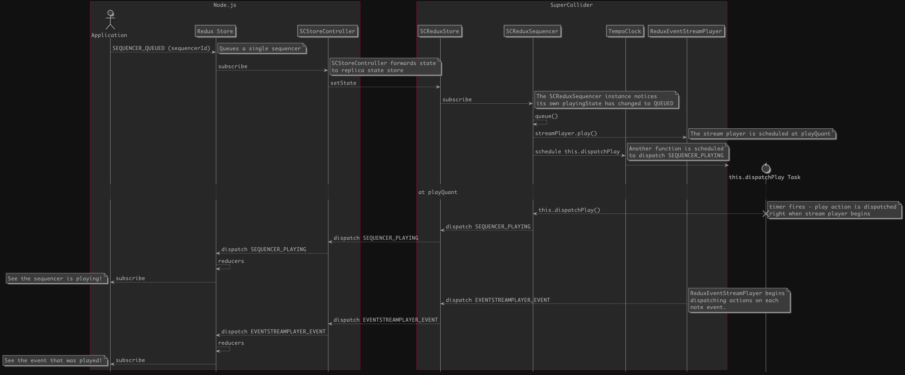

# supercollider-redux-sequencers
A Node.js and SuperCollider framework for generative musical sequencers based on [supercollider-redux](https://github.com/colinsullivan/supercollider-redux).  Provides the ability to start and stop SuperCollider patterns from Node.js and state updates to the Node.js process at each event played.

The SuperCollider pattern generators are intended to be written using the [Pbind](http://doc.sccode.org/Tutorials/A-Practical-Guide/PG_03_What_Is_Pbind.html) library, a prominent way to build generative event generators in SuperCollider.

The Node.js interface to SuperCollider is a [Redux](https://redux.js.org/) state store, all starting and stopping of sequencers occurs via actions dispatched to the store, and all note events received from the sequencers are actions dispatched from the SuperCollider state store.

## State Overview

State of all sequencers is stored by id in `sequencers`.  Each sequencer has the following attributes:

* `sequencerId`: A unique identifier for this sequencer, also used as the key to lookup in `sequencers`
* `classString`: A string representing the class to instantiate, expected to be a subclass of SCReduxSequencer.  In SuperCollider this is interpreted as a class and instantiated.
* `beat`: A count of the events that have passed.
* `nextBeat`: The SuperCollider clock beat on which the next event will occur.
* `nextTime`: The time in seconds when the next event will occur (measured from the previous event).
* `numBeats`: The duration of the sequence in clock beats.  If the sequence loops, this is the duration of one loop.
* `playingState`: One of `PLAYING_STATES` indicating if the sequence is stopped, queued, playing, etc.
* `isReady`: True if the sequencer's resources have initialized and it is ready to play.
* `playQuant`, `stopQuant`, and `propQuant`: These are the [Quant](http://doc.sccode.org/Classes/Quant.html) values to determine when the sequencer should quantize play, stop, or property changes. 
* `lastPropChangeQueuedAt`: A timestamp indicating when a `PROP_CHANGE_QUEUED` was dispatched.
* `lastPropChangeAt`: A timestamp indicating when properties last changed in response to a `PROP_CHANGE_QUEUED` action.
* `event`: The details of the most recently played event from the stream.
* `midiOutDeviceName`, `midiOutPortName`: If the stream is to send events to a midi socket instead of a SuperCollider synth, this is the device name and port.

## Sequence Example



## SuperCollider API
All SuperCollider code is included in a [quark](http://doc.sccode.org/Guides/UsingQuarks.html) inside the `quarks/supercollider-redux-sequencers` directory.

### `SCReduxSequencer`
Plays a stream to a specific clock and with a `ReduxEventStreamPlayer`.  Responds to state changes in the store, scheduling starting and stopping of the event stream player appropriately.  To use, create a subclass and implement `initStream`.  Everything else is optional.

```supercollider
MetronomeSequencer : SCReduxSequencer {
  var pat,
    patStream,
    patchSynth;

  initPatch {
    // define a simple synth
    patch = Patch({
      arg freq, amp = 0.0;
      var out;
      out = SinOsc.ar(freq, 0, amp) * EnvGen.kr(Env.linen(0.001, 0.05, 0.3), doneAction: 2);
      [out, out];
    });
    patchSynth = patch.asSynthDef().add();
    ^patch
  }

  initStream {

    pat = Pbind(
      // the name of the SynthDef to use for each note
      \instrument, patchSynth.name,
      \midinote, Pseq([96, 84, 84, 84], inf),
      // rhythmic values
      \dur, 1
    );

    ^pat.asStream();
  }
}
```

### `SCReduxSequencerFactory`
Watches the `sequencers` dictionary at the root level of the state tree and instantiates sequencers.  Expects a `clockController` and `store`

### Internal classes:

* `ReduxEventStreamPlayer`: This is a subclass of `EventStreamPlayer` which will dispatch actions each time an event from the stream is played.  Very useful for modifying other state based on the playback of a Pattern, for example.
* `SCReduxSequencers`: A class providing a static object for action types.

## Examples

To run the examples:

    npm install

For each example, there is a Node.js script and a SuperCollider script that must be run simultaneously.

### Basic Example
This example plays a metronome implemented in `MetronomeSequencer.sc`.  It is now in `testMetroExample.js` as well.

    $ npm run start_example

### Sampler
This example demonstrates a sampler that requires samples are loaded.

    $ npm run start_sampler_example

### Parameterized
This example demonstrates how a SuperCollider pattern can be parameterized through the state store.  See `ParamExampleSequencer` in the quark.

    $ npm run start_parameter_example

## Unit Tests

    $ npm run test
